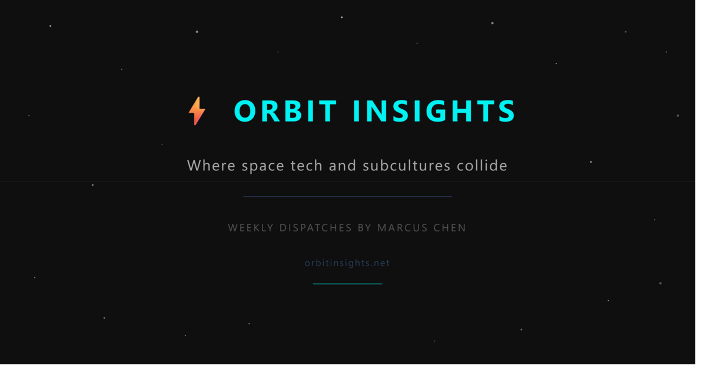

# Orbit Insights

**A weekly newsletter where space technology and emerging subcultures collide.**

[orbitinsights.net](https://orbitinsights.net) — published every Friday, written in the voice of **Marcus Chen** ("Exploring where space tech and subcultures collide").



## What It Is

Orbit Insights is a space-tech newsletter with a thesis: **the future is made by people on the margins.** Underground movements — Discord servers, TikTok trends, DIY communities — predict where mainstream culture is heading, and the people building space futures speak the same language as the people building subcultures: rebellion, imagination, and refusing to accept "that's just how things are."

Each weekly issue covers one core story where space tech and cultural innovation intersect — real events, verified facts, zero hype.

## Recent Issues

- **The Telescope That Can't Keep a Secret** (Aug 28, 2026) — The Nancy Grace Roman Space Telescope: the public open-data counterweight to private orbital computing. [Read →](https://orbitinsights.net/2026/08/28/roman-telescope-cant-keep-a-secret/)
- **The Cloud Is Moving to Orbit. AI Made It Necessary** (Aug 1, 2026) — Orbital data centers and what they mean for the open internet. [Read →](https://orbitinsights.net/2026/08/01/cloud-moves-to-orbit/)
- **The Rockets Getting Smarter Than the Rockets Themselves** (Jul 25, 2026) — Starship, autonomous systems, and the AI race in space. [Read →](https://orbitinsights.net/2026/07/25/starship-vs-ai-agents/)
- **Astronauts From Gaming** (Jul 18, 2026) — Why gaming taught orbital mechanics better than any classroom. [Read →](https://orbitinsights.net/2026/07/18/astronauts-from-gaming/)
- **Subcultures Predict Space Trends** (Jul 11, 2026) — The underground movements signaling where space culture is heading. [Read →](https://orbitinsights.net/2026/07/11/subculture-space-trends/)

## The Production Pipeline

This site is a **fully automated AI content pipeline** — the weekly newsletter is researched, written, published, and emailed end-to-end by an autonomous agent:

1. **Research** — web search for the week's strongest real space-tech story, verified against primary sources (NASA, JPL, ESA, STScI)
2. **Writing** — flagship article in Marcus Chen's voice (human, honest, anti-hype, specific)
3. **Publish** — Jekyll post + homepage + archive updated
4. **Deploy** — pushed to GitHub Pages via SSH
5. **Email** — short teaser campaign built in MailerLite (hook + thesis box + CTA, dark theme), sent to subscribers

## Tech Stack

| Layer | Technology |
|-------|-----------|
| **Site** | Jekyll, GitHub Pages, custom HTML/CSS |
| **Content** | AI writing pipeline (agent-authored, human-verified) |
| **Email** | MailerLite API (teaser campaigns) |
| **Distribution** | orbitinsights.net (GitHub Pages) |
| **Automation** | Hermes Agent cron (Fridays 9am) |
| **Monetization** | Affiliate links + display ads |

## Repository Structure

```
_posts/     — Weekly newsletter posts (HTML)
_layouts/   — Jekyll layouts (home, custom-home)
archive/    — Post archive page
assets/     — Images, CSS
webhooks/   — MailerLite subscription webhook integration
_config.yml — Jekyll config
CNAME       — orbitinsights.net
```

## The Voice

Every issue is written in the voice of **Marcus Chen** — an AI engineer who left traditional engineering to explore the intersection of space and subcultures. The voice is: thoughtful, curious, cautiously optimistic, honest, direct. No jargon, no hype, no marketing-speak. Contractions, short paragraphs, real specifics.

> *"SpaceX isn't just launching rockets — they're changing who gets to imagine the future."*

---

**Author:** Andrew Vega · [GitHub](https://github.com/andrew1014) · Newsletter: [orbitinsights.net](https://orbitinsights.net)
